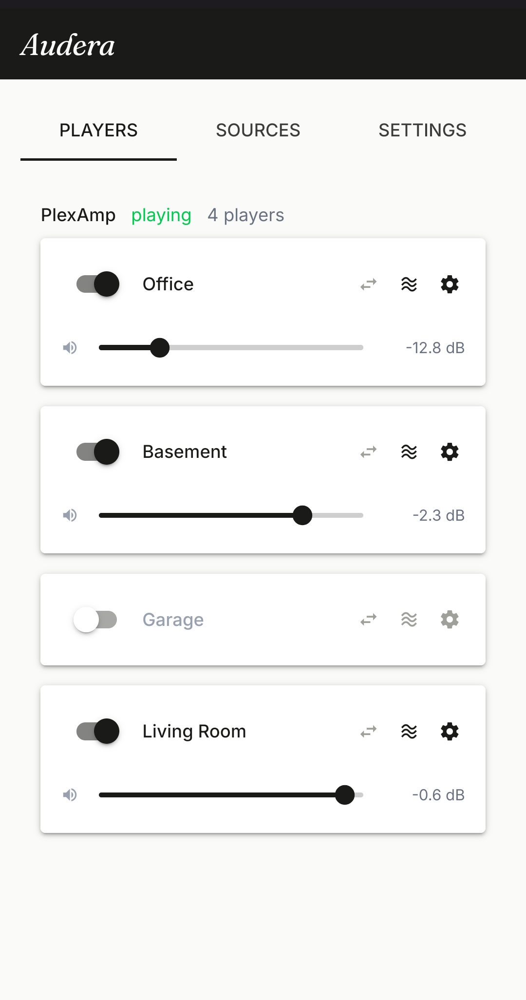
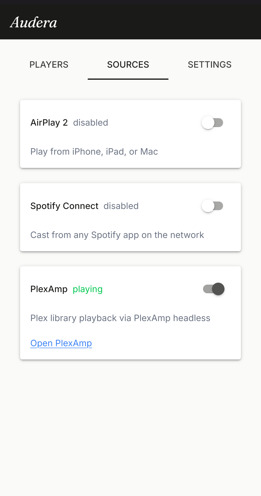
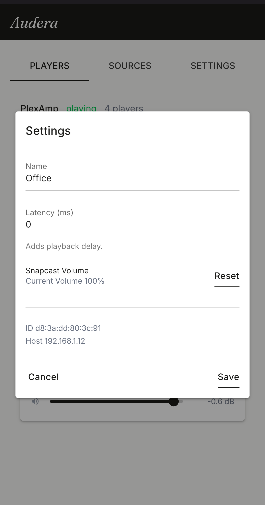
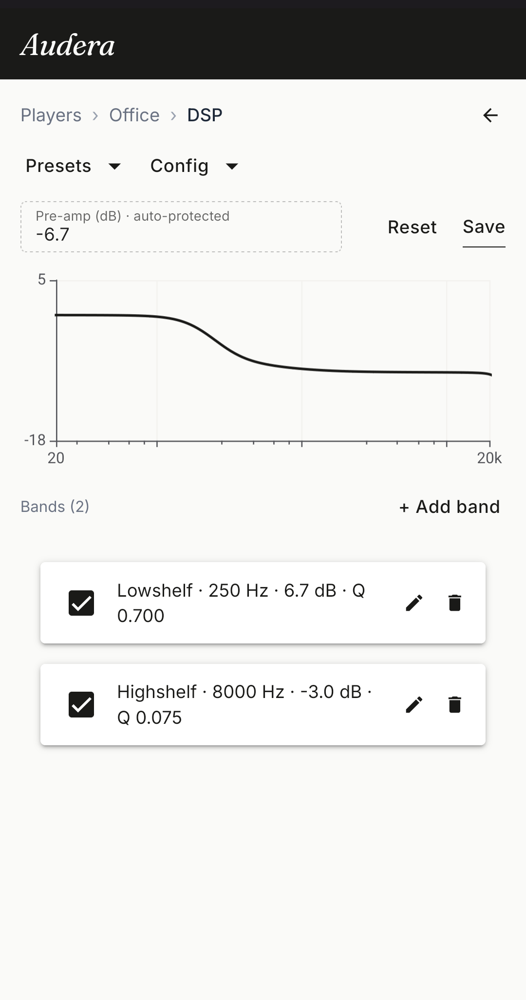

     ________  ___  ___  ________  _______  ________  ________     
    |\   __  \|\  \|\  \|\   ___ \|\   ___\|\   __  \|\   __  \    
    \ \  \|\  \ \  \\\  \ \  \_|\ \ \  \__|\ \  \|\  \ \  \|\  \   
     \ \   __  \ \  \\\  \ \  \ \\ \ \   __\\ \      /\ \   __  \  
      \ \  \ \  \ \  \\\  \ \  \_\\ \ \  \_|_\ \  \  \ \ \  \ \  \ 
       \ \__\ \__\ \______/\ \______/\ \______\ \__\\ _\\ \__\ \__\
        \|__|\|__|\|______| \|______| \|______|\|__|\|__|\|__|\|__|

**Audera** is a private, DSP-corrected, multi-room synchronous audio playback operating-system that runs on your **own** `Raspberry Pi` hardware, with no cloud accounts and no proprietary boxes.

It is built entirely on open source protocols - [Snapcast](https://github.com/badaix/snapcast) and [CamillaDSP](https://github.com/HEnquist/camilladsp).

[](https://github.com/Eleff-org/audera/actions/workflows/tests.yml)
[](https://github.com/Eleff-org/audera/releases/latest)
[](LICENSE)

## What it looks like

The **Audera Streamer** hosts a local web app for managing devices (incl. latency adjustment), sources, player streams, and per-player DSP pipelines.

<table>
<tr>
<td align="center" width="25%"></td>
<td align="center" width="25%"></td>
<td align="center" width="25%"></td>
<td align="center" width="25%"></td>
</tr>
<tr>
<td align="center"><b>Players</b></td>
<td align="center"><b>Sources</b></td>
<td align="center"><b>Player settings</b></td>
<td align="center"><b>DSP</b></td>
</tr>
</table>

Take the full tour in [Features](docs/features.md).

## Documentation

- [Getting started](docs/getting-started.md) — set up your **Audera** devices and start listening.
- [Features](docs/features.md) — a walkthrough of the **Streamer** web app.
- [Contributing](docs/README.md#contributing) — conventions and practices for contributing.
- [CLI Reference](docs/dev/CLI.md) — learn about the `audera` CLI tool.
- [Architecture decisions](docs/adrs/README.md) — the decision records behind the design.

## Architecture

| Service | Role | Port |
|---|---|---|
| [**Snapserver / Snapclient**](https://github.com/badaix/snapcast) | Synchronized multi-room audio distribution | 1704 (audio), 1780 (HTTP API) |
| [**CamillaDSP**](https://github.com/HEnquist/camilladsp) | Per-device DSP pipeline (EQ, room correction) | 1234 (WebSocket) |
| [**Plexamp**](https://www.plex.tv/plexamp/) (headless) | Music source / playback queue | 32500 (HTTP) |
| [**shairport-sync**](https://github.com/mikebrady/shairport-sync) | AirPlay 2 receiver source | 7000, mDNS (`_airplay._tcp`) |
| [**go-librespot**](https://github.com/devgianlu/go-librespot) | Spotify Connect receiver source | Zeroconf (`_spotify-connect._tcp`) |

**Audera** is made of two device types:

- **Streamer** — one per household. Runs Snapserver, Snapclient, CamillaDSP, Plexamp (headless), and the shairport-sync (AirPlay 2) and go-librespot (Spotify Connect) receivers, and hosts the web app at `audera.local` that controls every connected player. Acts as a player itself.
- **Player** — one per room. Runs Snapclient and CamillaDSP, joins the streamer automatically on boot, and is managed from the streamer web app.

CamillaDSP sits in each device's Snapclient audio path, so every room is corrected independently.

## Getting started

**Audera** runs on [DietPi](https://dietpi.com/) on `Raspberry Pi` hardware. Flash a device, then provision it remotely from a host machine:

```bash
bash os/dietpi/setup/provision.sh \
  --device streamer \
  --host <IP> \
  --audio-device hdmi
```

The script installs and configures everything over SSH, then hands off to Wi-Fi setup. Once it finishes, open your **Streamer** web app at `audera.local`.

For hardware selection, flashing, Wi-Fi setup, and the full options reference, see [Getting started](docs/getting-started.md).
