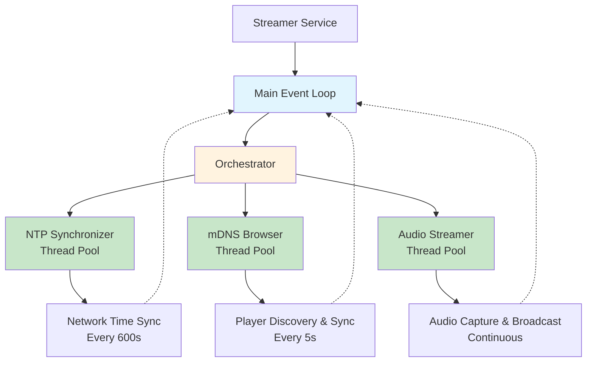
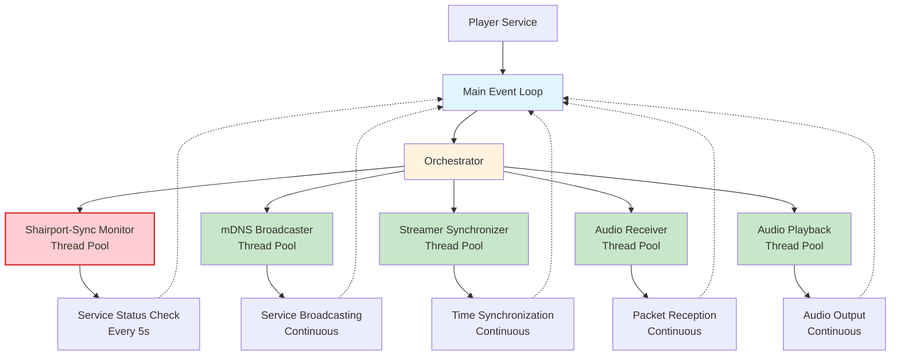

     ________  ___  ___  ________  _______  ________  ________     
    |\   __  \|\  \|\  \|\   ___ \|\   ___\|\   __  \|\   __  \    
    \ \  \|\  \ \  \\\  \ \  \_|\ \ \  \__|\ \  \|\  \ \  \|\  \   
     \ \   __  \ \  \\\  \ \  \ \\ \ \   __\\ \      /\ \   __  \  
      \ \  \ \  \ \  \\\  \ \  \_\\ \ \  \_|_\ \  \  \ \ \  \ \  \ 
       \ \__\ \__\ \______/\ \______/\ \______\ \__\\ _\\ \__\ \__\
        \|__|\|__|\|______| \|______| \|______|\|__|\|__|\|__|\|__|

`alpha-release` coming soon!

`audera` is an open-source multi-room audio streaming system written in Python for DIY home audio enthusiasts.

## Architecture overview

Audera uses a sophisticated **orchestrator pattern** to ensure reliable, high-performance audio streaming:

- **Isolated execution**: Critical I/O and timing-sensitive tasks run in dedicated thread pools
- **Event loop protection**: Main asyncio event loop stays responsive for coordination
- **Automatic recovery**: Failed tasks restart automatically with configurable timeouts
- **Resource management**: Thread pools prevent resource exhaustion under load

### Orchestrator Benefits

- **Zero Blocking**: I/O operations never freeze the event loop
- **Timing Precision**: Critical synchronization maintains sub-millisecond accuracy
- **Automatic Recovery**: Failed tasks restart with configurable retry logic
- **Resource Efficiency**: Thread pools scale with system capabilities
- **Operational Control**: Dynamic start/stop of services via orchestrator API

## How `audera` works

The streamer and player applications use an **orchestrator** to isolate critical tasks from blocking the main asynchronous event loop. Tasks involving I/O operations, timing-critical synchronization, or blocking operations are executed in dedicated thread pools, while lightweight coordination tasks run in the main event loop.

### Streamer

The streamer service isolates the following critical tasks:
- **Network time protocol (NTP) synchronization** - Timing-critical network I/O
- **Remote audio output player mDNS browsing** - Network discovery with player synchronization
- **Audio stream capturing and broadcasting** - Blocking audio I/O operations

#### Orchestrated task flow



#### Getting Started

The streamer service automatically orchestrates all critical tasks for reliable audio streaming. Run from the command-line:

```bash
audera run streamer
```

Or through a Python session:

```python
import asyncio
import audera

if __name__ == '__main__':
    asyncio.run(audera.streamer.Service().run())
```

### Player

The player service isolates the following critical tasks:
- **Shairport-sync service monitoring** - Subprocess management of shairport-sync for Airplay2 connectivity
- **mDNS broadcasting** - Network service discovery I/O
- **Streamer synchronization** - Timing-critical clock synchronization
- **Audio stream receiving** - Audio packet I/O operations
- **Audio playback** - Blocking audio output operations

#### Orchestrated Task Flow



#### Getting Started

The player service uses full task orchestration for optimal audio playback performance. Run from the command-line:

```bash
audera run player
```

Or through a Python session:

```python
import asyncio
import audera

if __name__ == '__main__':
    asyncio.run(audera.player.Service().run())
```