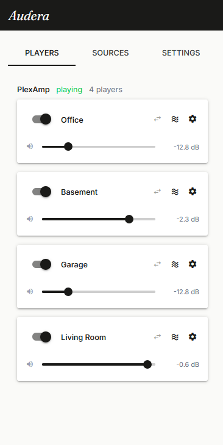

---
hide:
  - navigation
  - toc
---

<section class="audera-hero" markdown>

<header class="audera-nav" markdown>
Audera

[GitHub ↗](https://github.com/Eleff-org/audera)

</header>

<h1 class="audera-tagline">A new era of composable audio systems</h1>

Audera integrates open protocols (`Snapcast`, `CamillaDSP`) to provide DSP-corrected, multi-room, synchronized audio playback.
{ .audera-body .audera-body--lead }

[Get started →](getting-started/index.md){ .site-cta }

{ .audera-shot }

</section>
